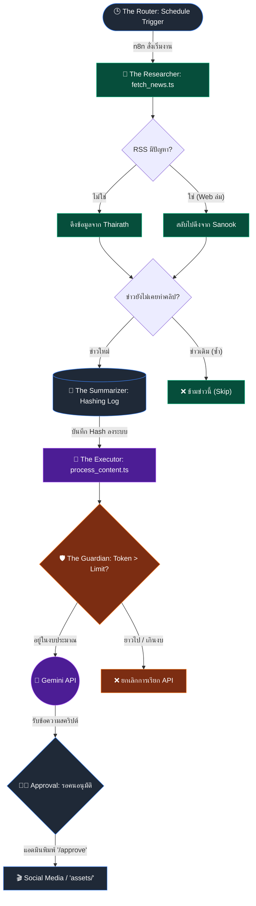

# 🤖 Pang Game Company - Project Summary

เอกสารสรุปสถาปัตยกรรมและรายละเอียดการดำเนินการสร้างระบบ **"Pang Game Company"** สำหรับการผลิตคลิปวิดีโอสั้นจากข่าวประจำวันอัตโนมัติ

## 🎯 ภาพรวมของระบบ (Overview)
โปรเจกต์นี้ถูกออกแบบมาในรูปแบบ **Multi-Agent System (5 Roles)** เพื่อให้ n8n และ Run-time อย่าง Bun ทำงานผสานกันเป็นสายพานผลิต Content โดยตั้งเป้าหมายหลักคือ **"การควบคุมงบประมาณไม่ให้เกิน 1,000 บาท/เดือน"** ผ่านระบบ Guardrail และหลีกเลี่ยง Docker

---

## 🏢 แผนกและโครงสร้างบริษัท (Company Departments)
บริษัท **Pang Game Company** ออกแบบโครงสร้างแผนกและโฟลเดอร์ไว้ดังนี้:

```text
📂 pang-game-company/
 ├── 📂 assets/                     <-- โฟลเดอร์เก็บน้องปัง (Stickers) โลโก้ และไฟล์สื่อออฟไลน์
 ├── 📂 config/
 │    └── gemini_config.json        <-- [Master Prompt] คุม Tone of Voice และแบ่ง JSON (Static / Reels)
 ├── 📂 logs/
 │    └── processed_hashes.json     <-- เก็บประวัติข่าว กันการทำคลิปซ้ำซ้อน
 ├── 📂 scripts/
 │    ├── fetch_news.ts             <-- ดึงข่าว RSS (มีระบบสำรองอัตโนมัติ)
 │    ├── process_content.ts        <-- ให้ AI สร้างบทความข่าว (หัวใจหลัก)
 │    │
 │    ├── 📝 แผนกโพสต์ภาพ (Post Department)
 │    │    └── render_static.ts     <-- สั่ง Creatomate แปะ Layer ภาพ 1:1, พาดหัว, ป้ายราคา
 │    │    └── social_post.ts       <-- อัปโหลดแคปชั่นและรูปขึ้น Facebook/IG
 │    │
 │    ├── 🎬 แผนกวิดีโอ (Reels Department)
 │    │    └── text_to_speech.ts    <-- สั่ง ElevenLabs พากย์เสียง
 │    │    └── render_video.ts      <-- สั่ง Creatomate สร้างคลิป 9:16 สไตล์เกมปัง
 │    │
 │    └── test_pipeline.ts          <-- ไฟล์สำหรับทดสอบการทำงานรวดเดียวจบ
 ├── 📂 workflows/
 │    └── n8n-architecture.md       <-- คู่มือการโยง Flow แผนกต่างๆ ใน n8n
 └── index.html                     <-- [Dashboard] หน้ามอนิเตอร์สถานะการทำงานของแต่ละแผนก
```

## 🎭 สรุปฟีเจอร์ป้องกันรอยต่อ (Seamless Update V1.1)
1. **Error Fallback**: ในขั้น Researcher หากสำนักข่าวหลัก Down จะสลับไปเอา RSS ของสำนักข่าวสำรองอัตโนมัติเพื่อไม่ให้สายพานหยุด
2. **Duplicate Hashing**: นำ Hash Generator มาใช้ควบคู่กับ JSON ในแฟ้ม logs/ เพื่อจำประวัติ 1,000 คลิปหลังสุด กันไม่ให้ AI ทำคลิปซ้ำข่าวเดิม (ประหยัดงบ)
3. **Voiceover Pipeline**: เพิ่มโฟลเดอร์ `assets/` รักษารูปแบบ Directory Structure เตรียมต่อยอดส่งสคริปต์ให้เครื่องมือแปลงเสียงพูด
4. **OpenClaw Dashboard**: หน้าจอติดตามผลเรียลไทม์จำลองสไตล์เกม MMO ที่มีระบบแสดง Log เป็นช่องแชท

---

## 🗺️ แผนผังการทำงานของสายพาน (Workflow Diagram)
ระบบมีการไหลของข้อมูลตั้งแต่ต้นน้ำยันปลายน้ำ โดยใช้ Agent ทั้ง 5 ตัวคอยประสานงานและตรวจสอบความปลอดภัย ดังนี้ครับ:


